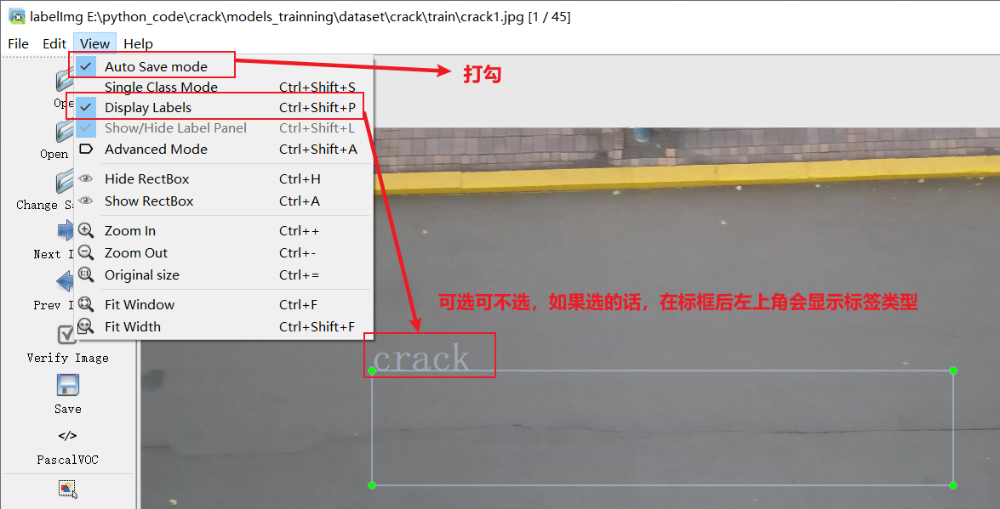

# 训练自己的YOLOv8模型

## 准备数据集

### 安装 LabelImg

在命令提示符中输入以下命令：

```bash
pip install labelimg -i https://pypi.tuna.tsinghua.edu.cn/simple
```

等待安装完成


运行

```bash
labelimg
```

启动之后界面长这样


设置自动保存



labelimg的常用快捷键（熟练使用快捷键，提高效率）

|       快捷键       |          功能             |
| :---              |        :----:             |
| W                 | 画框（创建或编辑标签框）    |
| D                 |切换到下一张图片             |
| A                 |切换到上一张图片             |
| CTRL+Q            | 退出LabelImg              |
| CTRL+S            |保存当前图片的标签           |
| Delete            | 删除当前选中的标签框        |

### 开始标注

- 点击Open Dir 选择原图片所在文件夹

- 点击Change Save Dir 选择存储位置

- 使用快捷键，开始标注，左侧将格式设置成yolo


### 将标注好的数据集按照指定路径放置


## 训练YOLOv8模型

- 由于本地安装cuda较为麻烦，这里不做介绍，本文将使用腾讯云算力平台

### 登录并进入腾讯云高性能应用服务 HAI


### 创建实例

- 可选用预装了cuda的Pytorch，算力方案越贵，训练速度越快，普通1.2元/时的也够用了。


- 创建实例之后，选择CloudStudio进入后台


- 在终端安装yolo环境，克隆训练程序，上传数据集

- 使用国内服务器时候可使用清华源加速

```bash
pip install ultralytics -i https://pypi.tuna.tsinghua.edu.cn/simple
```

- 使用国外服务器时候可直接

```bash
pip install ultralytics
```

- 安装libGL.so.1 库

```bash
sudo apt-get update
sudo apt-get install libgl1-mesa-glx
```

- 环境安装完成后，克隆此训练代码

```bash
git clone http://gitea.qutcmrt.top/Robofish/YOLOv8.git
```

- 上传刚刚准备好的数据集datasets


- 修改yolo.yaml的内容，直接复制绝对路径。


### 开始训练

```bash
yolo train data=yolo.yaml model=yolov8n.pt epochs=300 imgsz=640 batch=8 workers=0 device=0
```

- 其中 data=YOLO.yaml 修改为实际yaml路径，model=yolov8n.pt修改为模型路径（按照教程走不用修改）
- 如果使用cpu训练，修改device='cpu',如果想使用多卡训练，device='\0,1,2,xxx\'


### 结束训练

- 训练完成的模型将位于 ' runs\detect\train\weights '


- 右键下载，即可将训练好的模型下载到本地。

## 测试模型

- 在安装了ultralytics的电脑中，运行scripts文件夹中的track_test.py,修改模型和摄像头。

## 常见问题

### LabelImg无法标注，闪退

- 路径不能有中文
- 请使用python3.9（推荐使用anconda）

### 使用yolov8n 但是下载的是yolo11n

- 删除文件夹里的yolov8n.pt即可。（其实可以直接用11了，速度更快，效果更好）
